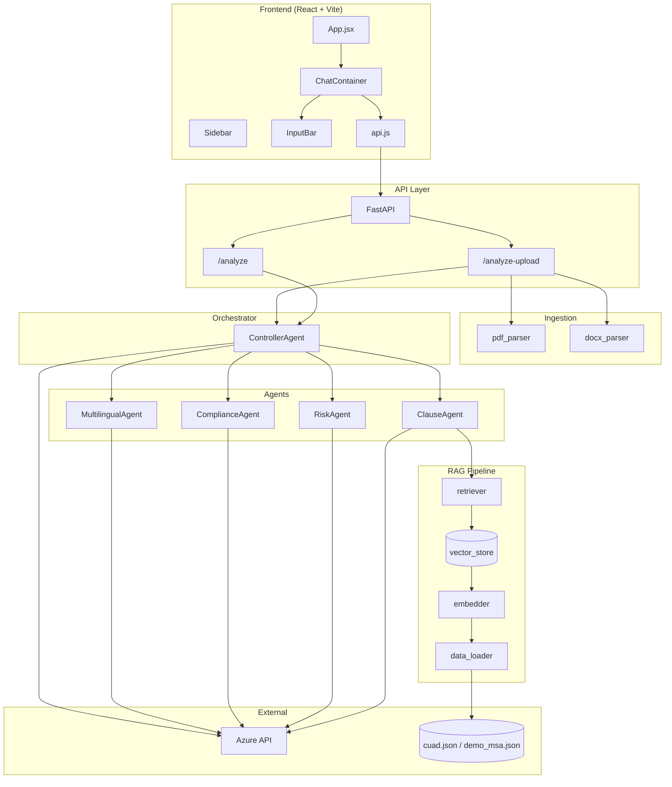
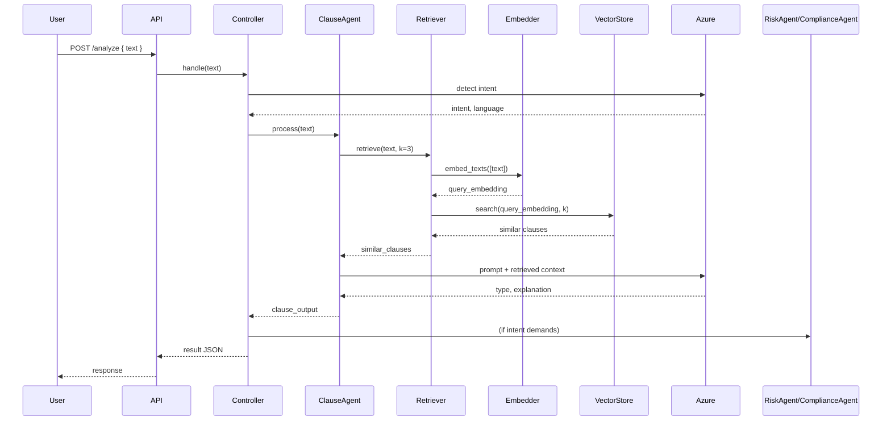

# Legal Risk Analyzer — Architectural Design

## 1. High-Level Architecture

```
┌─────────────────────────────────────────────────────────────────────────────────┐
│                              PRESENTATION LAYER                                  │
│  ┌─────────────────────────────────────────────────────────────────────────┐   │
│  │  React (Vite) Frontend — legal-ui                                        │   │
│  │  • App.jsx  • Sidebar  • Header  • ChatContainer  • InputBar  • api.js   │   │
│  └─────────────────────────────────────────────────────────────────────────┘   │
└─────────────────────────────────────────────────────────────────────────────────┘
                                        │
                                        │ HTTP (REST)
                                        ▼
┌─────────────────────────────────────────────────────────────────────────────────┐
│                              API LAYER                                           │
│  ┌─────────────────────────────────────────────────────────────────────────┐   │
│  │  FastAPI — backend/api/main.py                                           │   │
│  │  • POST /analyze        (text analysis)                                  │   │
│  │  • POST /analyze-upload (PDF/DOCX + optional instruction)                 │   │
│  │  • CORS → localhost:5173                                                  │   │
│  └─────────────────────────────────────────────────────────────────────────┘   │
└─────────────────────────────────────────────────────────────────────────────────┘
                                        │
                                        │ single entry point
                                        ▼
┌─────────────────────────────────────────────────────────────────────────────────┐
│                              ORCHESTRATION LAYER                                 │
│  ┌─────────────────────────────────────────────────────────────────────────┐   │
│  │  ControllerAgent — agents/controller_agent.py                            │   │
│  │  • Intent detection (Azure): translation | risk | compliance | full     │   │
│  │  • Routes to: ClauseAgent, RiskAgent, ComplianceAgent, MultilingualAgent │   │
│  └─────────────────────────────────────────────────────────────────────────┘   │
└─────────────────────────────────────────────────────────────────────────────────┘
                                        │
          ┌─────────────────────────────┼─────────────────────────────┐
          ▼                             ▼                             ▼
┌──────────────────┐  ┌──────────────────┐  ┌──────────────────┐  ┌──────────────────┐
│   ClauseAgent    │  │   RiskAgent      │  │ ComplianceAgent  │  │ MultilingualAgent│
│   (RAG + LLM)    │  │   (LLM)          │  │   (LLM)          │  │   (LLM)          │
└────────┬─────────┘  └──────────────────┘  └──────────────────┘  └──────────────────┘
         │
         ▼
┌─────────────────────────────────────────────────────────────────────────────────┐
│                              RAG LAYER                                           │
│  ┌─────────────┐   ┌─────────────┐   ┌─────────────┐   ┌─────────────────────┐  │
│  │ data_loader │ → │  embedder   │ → │ vector_store│ ← │     retriever       │  │
│  │ (JSON)      │   │ (MiniLM)    │   │ (FAISS)     │   │ (query → k-NN)      │  │
│  └─────────────┘   └─────────────┘   └─────────────┘   └─────────────────────┘  │
└─────────────────────────────────────────────────────────────────────────────────┘

┌─────────────────────────────────────────────────────────────────────────────────┐
│                              INGESTION LAYER (upload path only)                  │
│  ┌─────────────────┐  ┌─────────────────┐  ┌─────────────────┐                  │
│  │  pdf_parser     │  │  docx_parser     │  │ clause_splitter │                  │
│  │  (PyPDF2)       │  │  (python-docx)   │  │ (optional)      │                  │
│  └─────────────────┘  └─────────────────┘  └─────────────────┘                  │
└─────────────────────────────────────────────────────────────────────────────────┘

┌─────────────────────────────────────────────────────────────────────────────────┐
│                              EXTERNAL                                            │
│  • Azure (e.g. OpenAI / Azure AI) — all agent reasoning & intent                  │
│  • Data: backend/data/cuad.json, backend/data/demo_msa.json                      │
└─────────────────────────────────────────────────────────────────────────────────┘
```

---

## 2. Component Diagram (Mermaid)

Use this in slides or GitHub; Mermaid renders in many tools.



---

## 3. Request Flow

### Text analysis (`POST /analyze`)

1. **Frontend** sends `{ text }` via `api.js` → `analyzeText(text)`.
2. **FastAPI** receives request → calls `controller_agent.handle(text)`.
3. **ControllerAgent** uses **Gemini** to detect intent and optional language.
4. **Routing:**
   - **Translation** → MultilingualAgent (with ClauseAgent context).
   - **Clause** → ClauseAgent only (RAG + Gemini).
   - **Risk** → ClauseAgent (context) + RiskAgent.
   - **Compliance** → ClauseAgent (context) + ComplianceAgent.
   - **Full** → ClauseAgent + RiskAgent + ComplianceAgent.
5. **ClauseAgent** embeds query → FAISS k-NN → retrieves similar clauses → Gemini explains type and meaning.
6. Response is aggregated and returned as JSON to the frontend.

### File upload (`POST /analyze-upload`)

1. **Frontend** sends file + optional text via `analyzeFile(file, text)`.
2. **FastAPI** reads file → **pdf_parser** or **docx_parser** extracts text.
3. Combined prompt = `"User Instruction: {text}\n\nDocument Content:\n{file_text}"` (or just file text).
4. Same flow as text analysis: **ControllerAgent** → intent → agents → JSON response.

---

## 4. Data Flow (RAG)



---

## 5. Technology Stack

| Layer        | Technology |
|-------------|------------|
| **Frontend** | React, Vite, Tailwind CSS, Axios |
| **API**      | FastAPI, Uvicorn, CORS |
| **Orchestration** | Python, Google GenAI SDK |
| **Agents**   | Gemini 2.5 Flash (intent + clause/risk/compliance/translation) |
| **RAG**      | SentenceTransformer (all-MiniLM-L6-v2), FAISS, custom Retriever |
| **Ingestion**| PyPDF2, python-docx |
| **Data**     | JSON (cuad.json, demo_msa.json) |

---

## 6. Key Design Decisions

- **Single API entry** → one backend handle for both paste and upload; upload path adds parsing then reuses the same pipeline.
- **Intent-based routing** → one ControllerAgent with Gemini-based intent detection avoids separate endpoints per capability.
- **RAG only in ClauseAgent** → vector store built from clause JSON; other agents consume ClauseAgent’s retrieved context when needed (e.g. risk/compliance/translation).
- **Embeddings on CPU** → SentenceTransformer + FAISS; no separate embedding API.
- **Stateless API** → no server-side session; each request is independent; frontend keeps “analyses” list in React state.

---

## 7. File Map (for presentation)

| Path | Role |
|------|------|
| `frontend/legal-ui/src/App.jsx` | Root layout, sidebar + chat, analysis state |
| `frontend/legal-ui/src/lib/api.js` | `analyzeText`, `analyzeFile` — backend calls |
| `frontend/legal-ui/src/components/chat/*` | Chat UI, input, messages, document preview |
| `backend/api/main.py` | FastAPI app, `/analyze`, `/analyze-upload` |
| `backend/agents/controller_agent.py` | Intent detection, routing, response shape |
| `backend/agents/clause_agent.py` | RAG + Gemini for clause type & explanation |
| `backend/agents/risk_agent.py` | Risk assessment (Gemini) |
| `backend/agents/compliance_agent.py` | Compliance check (Gemini) |
| `backend/agents/multilingual_agent.py` | Translation with legal context |
| `backend/rag/rag_pipeline.py` | Builds vector store from data |
| `backend/rag/data_loader.py` | Loads cuad.json + demo_msa.json |
| `backend/rag/embedder.py` | SentenceTransformer embeddings |
| `backend/rag/vector_store.py` | FAISS index + metadata |
| `backend/rag/retriever.py` | Query → embed → k-NN → clauses |
| `backend/ingestion/pdf_parser.py` | PDF text extraction |
| `backend/ingestion/docx_parser.py` | DOCX text extraction |
| `backend/data/cuad.json`, `demo_msa.json` | Clause datasets for RAG |

---

You can copy the ASCII diagram or the Mermaid blocks into slides (e.g. Mermaid Live Editor or PowerPoint with a Mermaid add-in), or use the “File Map” as a one-slide reference.
